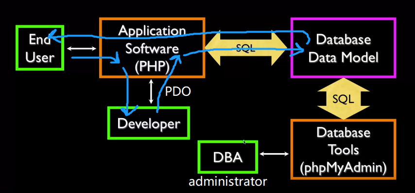
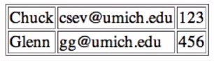
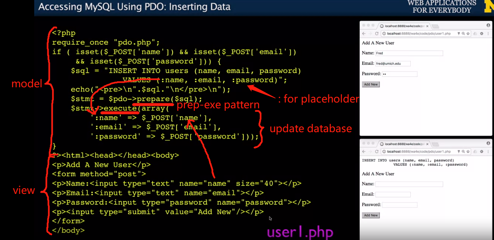
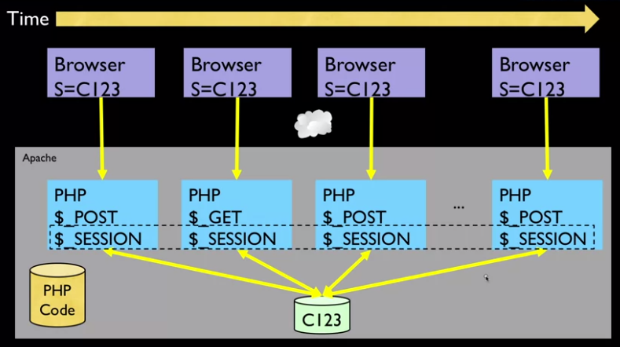
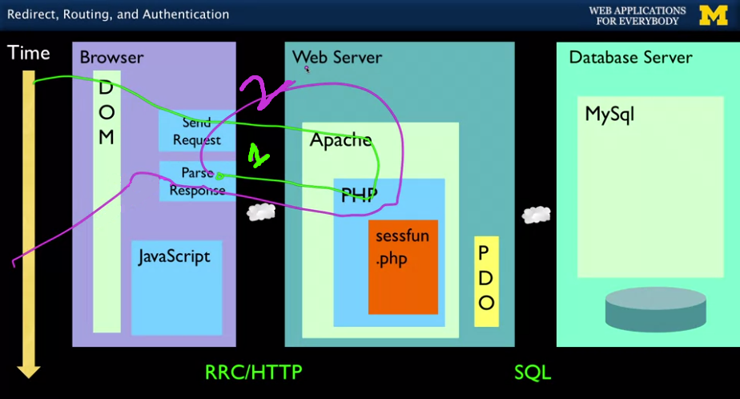

#### 0718


Some notations beforehand
---
Use `::` to access **static** item, a string constant or a static method, in a **class**. You can just call this static method of a class without instantiating an object. e.g.:

`echo DateTime::RFC822."\n";`

Use `->` to access item in an **object**,this is **daynamic**. Most things are dynamic. e.g.:

`echo $z->format('Y-m-d')."\n";`
<!---
<p align="center">
  <b>----I am the real starting line----</b>
</p>
--->
Object Life Cycle in PHP
---
Object Oriented approach was not introduced to PHP until PHP 5. 

Objects are created, used and discarded.((｡•́︿•̀｡)poor objects...)
Constructors are used a lot but destructors are seldom used. Garbage collector will take care of calling the destructors. e.g.:

```
class PartyAnimal {
    function __contruct() {
      echo("Constructed\n"):
    }
    function __somthing() {
      echo("Something\n"):
    }
    function __destruct() {
      echo("Destructed\n"):
    }
}

echo("--One\n");
$x = new PartyAnimal();
echo("--Two\n");
$y = new PartyAnimal();
echo("--Three\n");
$x->something();
echo("--The End?\n");
  
```
this prints out:

```
--One
Constructed
--Two
Constructed
--Three
Something
--The End?
Destructed
Destructed
```

use keyword `new` to instantiate an object from class in PHP, e.g.:
`$z = new DateTime('2012-01-31');`

The parameters for constructing new object is passed by the method starting with `__`, e.g.:

`public __construct([string $time = "now" [, DateTimeZone $timezone = NULL]])`

Inheritance in PHP
---
Instantiation happens between a class and an object, using `new`. Inheritance happens between a class and another class (subclasses), using `extends`. 


Scope of class member variables:
* Public - can be accessed inside the class, in derived classes and outside the class
* Protected - can be accessed inside the class and in derived classes.
* Private - can only be accessed inside the class, not visible in derived classes.

But, you can bypass those rules by passing a private variable to a public method. e.g.:
```
class MyClass
{
  public $pub = 'Public';
  protected $pro = 'Protected';
  private $priv = 'Private';
  
  function printHello()
  {
    echo $this->pub."\n";
    echo $this->pro."\n";
    echo $this->priv."\n";
  }
  
  $ obj = new MyClass();
  echo $obj->pub."\n";  // Works
  echo $obj->pub."\n";  // Fatal Error
  echo $obj->pub."\n";  // Fatal Error
  $obj->printeHello();  // Shows Public, Protected, Private
```
An example to test `protected variable`:
```
class MyClass2 extends MyClass
{
  function printHello()
  {
    echo $this->pub."\n";
    echo $this->pro."\n";
    echo $this->priv."\n";  // Undefiend
  }
  
  $ obj2 = new MyClass2();
  echo $obj2->pub."\n";  // Works
  $obj2->printeHello();  // Shows Public, Protected, Undefiend
```
  
You can define an empty class and put stuffs into it. A class is more used as an array this way:
```
$player = new stdClass();

$player->name = "Chuck";
$player->score = 0;
$player->score++;
print_r($player);
```
This prints:
```
stdClass Object
(
  [name] => Chuck
  [score] => 1
)
```

PHP Database Libraries
---
PHP Data Objects (PDO) is introduced in PHP5. Charles Severance says it stands for Portable Data Objects.

Where we use PDO:




From PHP5, non-OO`mysql_` routines is changed to `mysqli` OO version. PHP5 also introduced whole API for the then new structure PDO. Nowadays PDO is much more popular than `mysqli`. 

Running SQL Queries in PHP
---
SQL is very native and easy to use in PHP. You are literally sending SQL strings to database server, then you get a thing called `statement` back from the database server. This statement is passed by the `query` method of the `connection object`.

```
CREATE DATABASE misc;
GRANT ALL ON misc.* TO 'fred'@'localhost' INDENTIFIED BY 'zap';
GRANT ALL ON misc.* TO 'fred'@'127.00.1' INDENTIFIED BY 'zap';
USE misc;
```
This command asks for three rules: the username `fred`, the IP address `localhost` and the password `zap`. This is a way to firewall your database from access coming from outside. Usually the outside world can only talk to PHP server, but not database server. Their request to database server is handled and filtered through PHP server. This way, people can't even get a packet to the database server using VPN. 

A database connection is between PHP software and the database. It is like logging into your database. Use the code below in `pdo.php` to build this connection:

`$pdo = new PDO('mysql:host=localhost;port=8889;dbname=misc', 'fred', 'zap');`

3306 is the default port for xampp/linux/Windows, 8889 for Mac


```
<?php
echo "<pre>\n";
$pdo=new PDO('mysql:host = localhost; port8889; dbname=misc', 'fred', 'zap'); // build connection
$stmt = $pdo->query("SELECT * FROM users"); //get the statement
while ( $row = $stmt=>fetch(PDO::FETCH_ASSOC) ) { // loop through the records
  print_r($row);
}
echo "echo "<pre>\n";
?>
```
What you get is:
```
Array(
  [user_id] => 1
  [name] => Chuck
  [email] => csev@utk.edu
  [password] => 123
 )
 
 Array(
  [user_id] => 2
  [name] => Glenn
  [email] => gg@utk.edu
  [password] => 456
 )
 ```
 This associated array is generated from this table:
 ```
 +---------+-------+--------------+----------+
 | user_id |  name |    email     | password |
 +---------+-------+--------------+----------+
 |       1 | Chuck | csev@utk.edu | 123      |
 |       2 | Glenn | gg@utk.edu   | 123      |
 +---------+-------+--------------+----------+
 ```
 To present this array to user, it needs to be rendered in HTML, so a real code would look like:
 ```
 <?php
echo "<pre>\n";
$pdo=new PDO('mysql:host = localhost; port8889; dbname=misc', 'fred', 'zap'); // build connection
$stmt = $pdo->query("SELECT * FROM users"); //get the statement
while ( $row = $stmt=>fetch(PDO::FETCH_ASSOC) ) { // present the data to user
    echo "<tr><td>";
    echo($row['name']);
    echo("<tr><td>");
    echo($row['email']);
    echo("<tr><td>");
    echo($row['password']);
    echo("<tr><td>\n");
 }
 echo "</table>\n";
?>
```
The user will see this on browser:



To avoid repeating the code, we want to put the database connection in a single file and include it in all other files. Convention is called pattern in programming. The is the pattern to use for running SQL in PHP.

 An example of this datanase connection file `pdo.php` :
```
<?php
$pdo=new PDO('mysql:host = localhost; port8889; dbname=misc', 'fred', 'zap');
$pdo->setAttribute(PDO::ATTR_ERRMODE, PDO::ERRMODE_EXCEPTION); // to see errors folder for details during production
?>
```
note that the file and the variable do not have to be `pdo`. `ERRMODE_EXCEPTION` is a very talkative error mode.An example of the `thrid.php`:
```
<?php
echo "<pre>\n";
require_once "pdo.php";

$stmt = $pdo->query("SELECT * FROM users");
while ( $row = $stmt=>fetch(PDO::FETCH_ASSOC) ) { // loop through the records
  print_r($row);
}
echo "echo "<pre>\n";
?>
```
Insert data using PDO from user:
---


This `prepare-execute` pattern is nessary to avoid SQL injection.

Delete data
---
deleting data is always through `POST`, not `GET`, because you are not supposed to change anything on a `GET`, because crawlers don't follow `POST`, browsers don't let you double `POST`. 

The general pattern is:

check it is GET or POST 

=> make SQL string with placeholder 

=> prepare SQL string for the connection

=> execute statement to update the database

Cookie
---
Cookies are arbitrary pieces of data, usually chosen and first sent by the web server, and stored on the client computer by the web browser. The browser then sends them back to the server with every request, introducing states (memory of previous events) into otherwise stateless HTTP transactions. Without cookies, each retrieval of a web page or component of a web page would be an isolated event, largely unrelated to all other page views made by the user on the website. Unlike `GET` or `POST`, which is gone once your request is finished, `cookie` of same value comes with your request everytime.

[PHP](https://www.php.net/manual/en/features.cookies.php) transparently supports HTTP cookies. Cookies are a mechanism for storing data in the remote browser and thus tracking or identifying return users. You can set cookies using the `setcookie()` or `setrawcookie()` function. Cookies are part of the HTTP header, so `setcookie()` must be called before any output is sent to the browser. This is the same limitation that `header()` has. You can use the `output buffering functions` to delay the script output until you have decided whether or not to set any cookies or send any headers.

Session
---
cookie is used to unlock a session. Sessio is to store data. A session is a tiny file lives on the webserver, but it can extemnds to file in database. The cookie indicate the session ID in use. Server software stores data in the session that ut wants to have from one request to another from the same browser. Shopping cart or login informatin is stored in the session in the server. If you close the browser, this session identifier is gone. 

Use `session_start()` to initialize a PHP session before any output has come out. This means it should be used in the model code not the view code in MVC. `session_start()` either creates a session or reassociate the old session. You cannot use `$_SESSION` until `session_start()` is called. `$_GET`, `$_POST` and the cookies are set before the first line executes, but `$_SESSION` has to be initialized mannually. 

If the user has cookies set, we can use the array $\_SESSION to store data from one request to the next with a particular browser. `$_SESSION` is persist between request while `$_POST` and `$_GET` are not:



You can find where your `$_SESSION` is stored in `session.save_path` on PHPInfo. An example file name of a session is:`sess_0e3b3cafd33c72eeb74358e4db38cc40`, the string after session is the session ID. 

PHP Sessions Without Cookies
---
the cookie is a "browser thing"... not a "tab thing". It is to favor multiple login on the same site on different tabs what in the most of the cases is an advantage.

If the application needs to function within an iframe, or have more than one session active. i.e., multiple tabs to the same site, we cannot use session cookies. PHP has nice support for maintaining a session without a cookie. Below is the code to tell PHP we won't be using cooies for the session:

```
<?php 
  init_set('session.use_cookies', '0');
  init_set('session.use_only_cookies', 0);
  init_set('session.use_trans_sid', 1);
  
  session_start();
?>
```

parameter in `setcookie()` indicates how long this cookie can last at most.
```
<?php
if ( ! isset($_COOKIE['zap'])){
  setcookie('zap', '42', time()+3600); // cookie expire in one hour
}
?>
```

Redirect Response (403)
---
If your application has not yet sent any data, it can send a special header as part of the HTTP Response. The redirect header includes a URL that the browser is supposed to forward itself to. It was originally used for website that moved from one UTL to another.

when you click on a web page, it comes into your PHP server. It then sends a very special response called a `redirect` or a `403`. This response goes to your browser but it never gets to the DOM. The browser parse this response and immediately calls another GET request, maybe to the same script or different script.



HTTP Status Codes: 200 OK, 404 Not Found, **302** Found/Moved, also known as "redirect"

Example code to set this redirect header:
```
<?php
header('Location: http://www.example.com/');
?>
```
PHP does not send header (the model) until you send the first character of the body (the view), PHP accumulates the headers until the view/body/output is sent. This is not the output the user sees, but the output browser sees. This output can be an empty line in your php file. 

POST-Redirect-GET
---
If we used `POST` in our PHP, when user refresh the page, the `POST` will be executed again, this is terrible if the user is doing a payment or purchasing something. Or just remember `POST` is always considered as modified data by browser. To avoid this double post, we use `POST-Redirect-GET` pattern. This way we can change to a different PHP file. To keep the context data between different requests, we save data into sessions and obtain data from session. 

Once we use `header("Location: xxx.php");` to redirect a POST request, even it redirect to the same POST php file, the server will add a `GET` itself. So the new call on the same POST PHP file will fall through `if ( isset($_POST['xxx']) )` condition. 

**Never generate output on POST**

If you ever use `POST` in your page, you will always:
1. put something into the session
2. do a redirect
3. return
