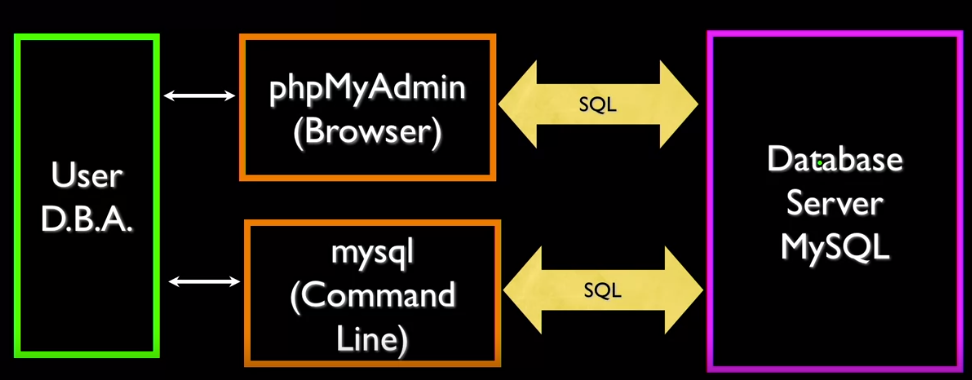

This course is taught by [Charles Severance](https://en.wikipedia.org/wiki/Charles_Severance) on Coursera. He also teaches several topics on Lynda/LinkedIn. I love his style. 

#### 2019-07-17

Databases Overview:
---
**Seqiential Access**: [Sequential Master Update (1970)](https://en.wikipedia.org/wiki/IBM_729), only update once for all records. Your bank account updates once a day.

**Random Access**: [Hard disk drive platter](https://en.wikipedia.org/wiki/Hard_disk_drive_platter), your bank account update after several seconds.

SQL Overview:
---
SQL is used to talk in between of clients and database server. There are two types of SQL clients: browser(phpMyAmin) and command line(mysql). There can be many clients talking to one database server simultaneously.


Basic Operations in SQL:
---
**Command line version to CREATE databse and table**:

`$mysql -u root -p`

`Enter password:`

`mysql>`
```
CREATE DATABASE People DEFAULT CHARACTER SET utf8;
USE People;
CREATE TABLE Users (
  name VARCHAR(128),
  email VARCHAR(128)
);
describe users;
```
(SQL keywords are case-insensitive)

**Browser version to CREATE databse and table**:

phpMyAmin => select one of the databases LHS => SQL => type: `CREATE DATABASE People DEFAULT CHARACTER SET utf8;` => press `Go` button => select `People` database LHS =>SQL => type: `xxxx` to create new tables

now you can click `Structure` to look at the metadat/column of the table

**INSERT**

`INSERT INTO Users (name, email) VALUES ('Chuck', 'csev@utk.edu');`

**DELETE**

`DELETE FROM Users WHERE email='ted@utk.edu'`

`WHERE` = `for` + `if` = looping through the whole Users table to find the entries that meet the conditions

**UPDATE**

`UPDATE Users SET name='Charles' WHERE email='csev@utk.edu'`

**SELECT**

`SELECT * FROM Users`

`SELECT * FROM Users WHERE email='csev@utk.edu'`

`*` means all the columns

**ORDER BY**

`SELECT * FROM Users ORDER BY email`

**LIKE**

it is like a wildcard select

`SELECT * FROM Users WHERE name LIKE '%e%'`

**LIMIT**

`SELECT * FROM Users ORDER BY email LIMIT 2`
`SELECT * FROM Users ORDER BY email DESC LIMIT 1,2`

**COUNT()** with **SELECT**

`SELECT COUNT(*) FROM Users`

((' ~ ')I don't like this one, why can't use `COUNT Users WHERE` directly...)

Data Types in SQL
---
**Text**: `TINYTEXT`(225), `TEXT`(65k), `MEDIUMTEXT`(16M), `LONGTEXT`(4G). It's real characters. 10 Latin characters are same as 10 Asian characters. No indexed or sorted. 

**Binary Types** (rarely used): `BYTE`(n)(255), `VARBINARY`(n)(65k). Character is 8-32 bits. No indexed or sorted. 

**Binary Large Object(BLOB)**: `TINYBLOB`(n)(255), `BLOB`(n)(65k), `MEDIUMBLOB`(n)(16M), `LONGBLOB`(n)(4G), Large raw data, files, images, word docs, PDFs, movies, etc.

**Integer Numbers**: `TINYINT`(-128, 128), `SMALLINT`(-32768, 32768), `INT` or `INTEGER` (2 billion), `BIGINT`(10^18 ish).

**Floating Point Numbers**: `FLOAT`(32-bit)(10^38 with 7 digits of accuracy), `DOUBLE`(64-bits)(10^308 with 14 digits of accuracy). Wide range but limited accuracy.

**Dates**: `TIMESTAMPE`-'YYYY-M-DD HH:MM:SS'(1970, 2037), `DATETIME`-'YYYY-M-DD HH:MM:SS', `DATE`-'YYYY-M-DD', `TIME`-'HH:MM:SS', Built-in MySQL funtion `NOW()`. 

Keys and Indexes in SQL
---
**AUTO_INCREMENT**

example:
```
DROP TABLE Users;
CREATE TABLE Users(
  user)id INT UNSIGNED NOT NULL AUTO_INCREMENT,
  name VARCHAR(128);
  email VARCHAR(128);
  PRIMARY KEY(user_id),
  INDEX(email)
)
```

There are techniques to greatly shorten the scan as long as you create date structures and maintain those structures such as Hashes(primary keys for exact matches) and Trees(sorting and prefetch matches). 

**MaySQL index Types**

* PRIMARY KEY: very little space, exact match, no duplicates, extremely fast for integer fields.

* INDEX: good for individual row lookup and sorting/grouping results - works best with exact matches or prefix lookups, can suggest HASH or BTREE.

B-Trees:


Relational Database Design
---
We need to find the balance between the objects that should go together and objects that should stay separate to make the links back and forth fastest. Basically the tradeoff between speed and flexibility. You can start by asking:

1. what is the core purpose of this application? (-learning management system)
2. What are the objects of the information? (- time, subject, sources, productivity, progress, notes)
3. What are the main objects that has to be vertically duplicated if not treated as an independet table?
4. What connections between all the object tables can reflect the actualy relationship and offer enough flexibility?

Database Normalization and Foreign Keys
---
**3NF**
* Do not replicate data(the whole point of SQL is to reconstruct the duplicated data)
* User integers for keys and for references
* Add a special "key" column to each table, which you will make refereces to

**Primary key**: auto-incremented

**Logical key**: outside world uses for lookup, usually a string

**Foreign key**: pointing to a row in another table, usually an integer

Never use the string logical key as the primary key, because they may change and they take more spaces. While integer primary keys are exact, say, 4 bytes, they can sorted very fast. 


Physical Data Schema
---
You build the tables from outside in, because the "parent" tables more rely on the "kid" tables, you start from the "kid" tables. Otherwise, SQL will throw errors because the tables that your foreign keys are pointing to have not been created.

Operations between tables 
---
**JOIN**

`JOIN` links across several tables as part of a `SELECT` operation, you must tell the `JOIN` how to use the keys that make the connections using an `ON` clause

example:

`SELECT Album.title, Artist.name FROM Album JOIN Artist ON`

Here `ON` gives us Album.artist_id = Artist.artist_id

`JOIN` building connection between all combinations of rows of Album and Artist

`ON` fiters in only the combinations that match 

( _(._.)_ this is so common, why we don't design key word as `OFF` instead of `ON`)

example:

`SELECT Track.title. Artist.name, Album.title, Genre.name FROM Track JOIN Genre JOIN Album JOIN Artist ON`

`ON` gives us: `Track.genre_id` = `Genre.genre_id` AND `Track.album_id` = `Album.album_id` AND `Album.artist_id` = `Artist.artist_id`

**ON DELETE/UPDATE CASCADE**

We are telling MySQL to clean up broken references.

example:

`DELETE FROM Genre WHERE name = 'Metal'`

choices:

* Default/RESTRICT: don't allow changes that break the constraint
* CASCADE: adjust child rows by removing or updating to maintain consistancy
* SET NULL: set the foreigh ket columns in the child rows to null


