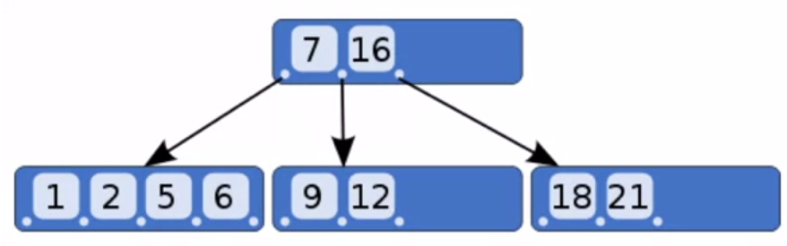

This course is taught by [Charles Severance](https://en.wikipedia.org/wiki/Charles_Severance) on Coursera. He also teaches several topics on Lynda/LinkedIn. I love his style. 

#### 2019-07-17

Databases Overview:
---
**Seqiential Access**: [Sequential Master Update (1970)](https://en.wikipedia.org/wiki/IBM_729), only update once for all records. Your bank account updates once a day.

**Random Access**: [Hard disk drive platter](https://en.wikipedia.org/wiki/Hard_disk_drive_platter), your bank account update after several seconds.

SQL Basic Operations:
---
SQL is used to talk in between of clients and database server. There are two types of SQL clients: browser(phpMyAmin) and command line(mysql). There can be many clients talking to one database server simultaneously.


**Command line version to CREATE databse and table**:

`$mysql -u root -p`

`Enter password:`

`mysql>`
```
CREATE DATABASE People DEFAULT CHARACTER SET utf8;
USE People;
CREATE TABLE Users (
  name VARCHAR(128),
  email VARCHAR(128)
);
describe users;
```
(SQL keywords are case-insensitive)

**Browser version to CREATE databse and table**:

phpMyAmin => SQL => type: `CREATE DATABASE People DEFAULT CHARACTER SET utf8;` => press `Go` button => select `People` database LHS =>SQL => type: `xxxx` to create new tables

now you can click `Structure` to look at the metadat/column of the table

**INSERT**

`INSERT INTO Users (name, email) VALUES ('Chuck', 'csev@utk.edu');`

**DELETE**

`DELETE FROM Users WHERE email='ted@utk.edu'`

`WHERE` = `for` + `if` = looping through the whole Users table to find the entries that meet the conditions

**UPDATE**

`UPDATE Users SET name='Charles' WHERE email='csev@utk.edu'`

**SELECT**

`SELECT * FROM Users`

`SELECT * FROM Users WHERE email='csev@utk.edu'`

`*` means all the columns

**ORDER BY**

`SELECT * FROM Users ORDER BY email`

**LIKE**

it is like a wildcard select

`SELECT * FROM Users WHERE name LIKE '%e%'`

**LIMIT**

`SELECT * FROM Users ORDER BY email LIMIT 2`
`SELECT * FROM Users ORDER BY email DESC LIMIT 1,2`

**COUNT()** with **SELECT**

`SELECT COUNT(*) FROM Users`

((' ~ ')I don't like this one, why can't use `COUNT Users WHERE` directly...)

Data Types in SQL
---
**Text**: `TINYTEXT`(225), `TEXT`(65k), `MEDIUMTEXT`(16M), `LONGTEXT`(4G). It's real characters. 10 Latin characters are same as 10 Asian characters. No indexed or sorted. 

**Binary Types** (rarely used): `BYTE`(n)(255), `VARBINARY`(n)(65k). Character is 8-32 bits. No indexed or sorted. 

**Binary Large Object(BLOB)**: `TINYBLOB`(n)(255), `BLOB`(n)(65k), `MEDIUMBLOB`(n)(16M), `LONGBLOB`(n)(4G), Large raw data, files, images, word docs, PDFs, movies, etc.

**Integer Numbers**: `TINYINT`(-128, 128), `SMALLINT`(-32768, 32768), `INT` or `INTEGER` (2 billion), `BIGINT`(10^18 ish).

**Floating Point Numbers**: `FLOAT`(32-bit)(10^38 with 7 digits of accuracy), `DOUBLE`(64-bits)(10^308 with 14 digits of accuracy). Wide range but limited accuracy.

**Dates**: `TIMESTAMPE`-'YYYY-M-DD HH:MM:SS'(1970, 2037), `DATETIME`-'YYYY-M-DD HH:MM:SS', `DATE`-'YYYY-M-DD', `TIME`-'HH:MM:SS', Built-in MySQL funtion `NOW()`. 

Keys and Indexes
---
**AUTO_INCREMENT**
```
DROP TABLE Users;
CREATE TABLE Users(
  user)id INT UNSIGNED NOT NULL AUTO_INCREMENT,
  name VARCHAR(128);
  email VARCHAR(128);
  PRIMARY KEY(user_id),
  INDEX(email)
)
```

There are techniques to greatly shorten the scan as long as you create date structures and maintain those structures such as Hashes(primary keys for exact matches) and Trees(sorting and prefetch matches). 

**MaySQL index Types**

* PRIMARY KEY: very little space, exact match, no duplicates, extremely fast for integer fields.

* INDEX: good for individual row lookup and sorting/grouping results - works best with exact matches or prefix lookups, can suggest HASH or BTREE.

B-Trees:




