This course is taught by [Charles Severance](https://en.wikipedia.org/wiki/Charles_Severance) on Coursera. He also teaches several topics on Lynda/LinkedIn. I love his style. 

#### 2019-07-15

Important people:
---
Brian Behlendorf: founded Apache

Rasmus Lerdorf: invented PHP

National Institute of Standards and Technology(NIST): SQL

Brendan Eich: invented Javascript

John Resig: started jQuery

Douglas Crockford: "discovered" JSON

Tim Berners-Lee and Robert CailliauT: invented http when they invented www

Tim Berners-Lee: invented URL (protocol+host+document+parameters).

Internet Engineering Task Force (IETF): Internet Standards (are called RFCs)

Important concepts
---
History of programming languages: 


Where HTTP lies: 
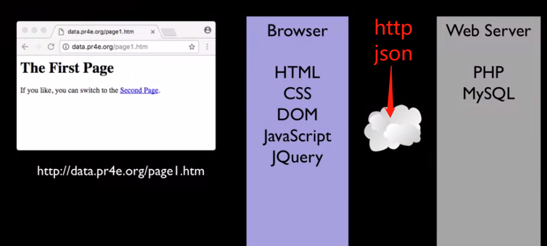

where http and sql lay:
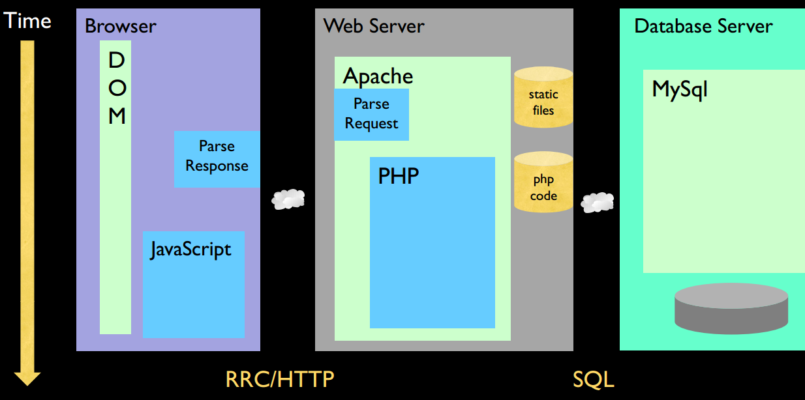

Response cycle: 


Topics to learn in this class:

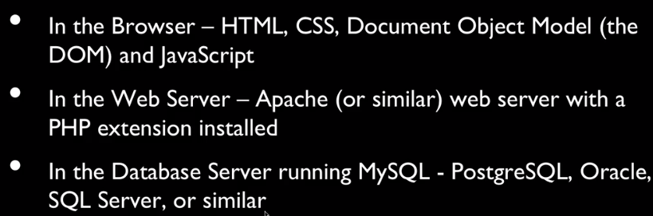

Type the folloing on terminal of Linux based systems (non-Windows basically):
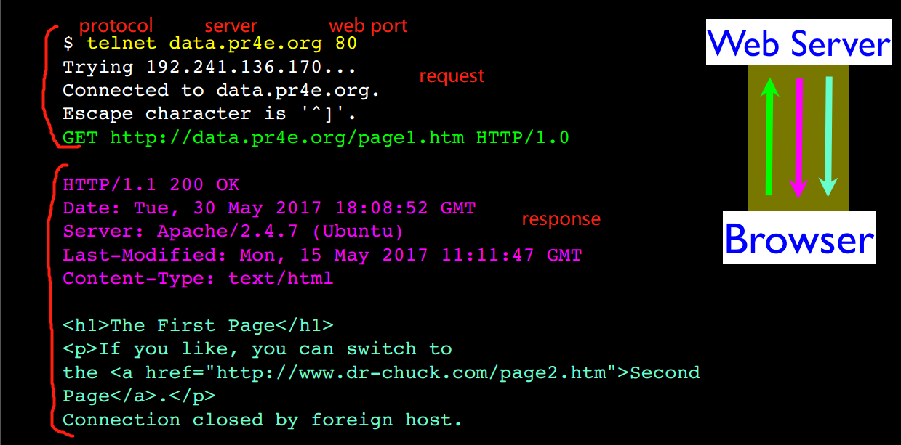

The above is automatically done by browser. You can find it in developer tool (Network-File-Headers):
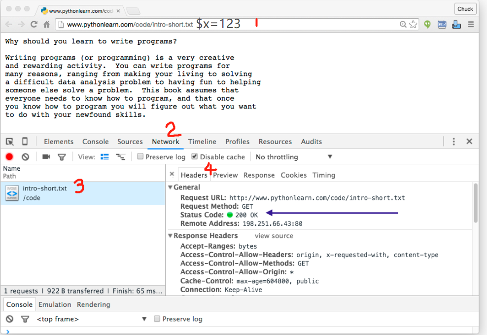

HTML syntax
----
* all tags: small letter, start and end pair
* attributes: double quotes
* comments: \<!--this comment also works in markdown, have to escape it(　・ˍ・), this can go multiple lines-->
* [html entities](https://www.w3schools.com/html/html_entities.asp)


* Anchor tag &lt;a href=&quot;nooooo&quot;>idk&lt;a> is for hypertext referece 
* \<li>\<p> item 1\</p>\</li>
* ```
  <table>
    <tr>
      <th> header 1</th>
    </tr>
    <tr>
      <td>data 1</td>
    </tr>
  </table>
  ```
No html, no search engine

Structure of HTML document:


HTML feature
----
content is wrapped dynamically:
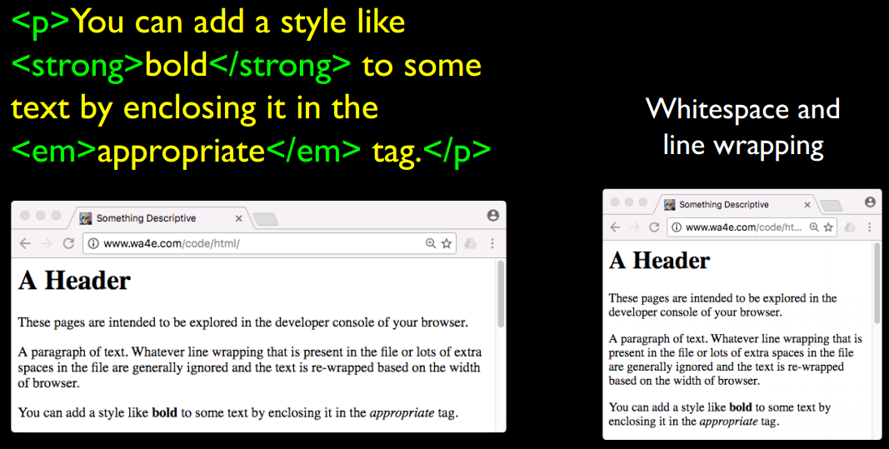

difference between HTML and DOM:

* DOM is read by browser from HTML
* DOM can fix some syntax mistakes in HTML file)
* you can change DOM in developer tool without changing the HTML source code 


My answer to week2 homework
---
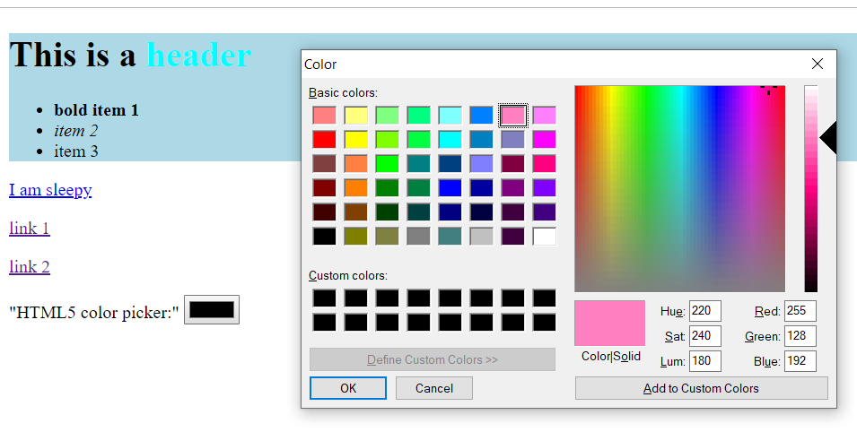

Language types:

* ***Imperative***:

    * tell the compiler step by step

    * ex. C, LINQ:
    
        ```
        List<int> results = new List<int>();
        foreach(var num in collection)
        {
            if (num % 2 != 0)
                  results.Add(num);
        }
        ```
        
    * sub-paradigms: **procedural**, **object-oriented**
        
* ***Declarative***:

    * tell the result you want

    * e.x. SQL, regular expression, HTML, CSS:
    
        `var results = collection.Where( num => num % 2 != 0);`
        
    * sub-paradigms: **functional**, **logic** 
    
    
Cascading Style Sheet (CSS)
---
Tags act in a cascading way. Since all Document Objects/tags are sitting in the hierarchical model, the attributes defined in higher level tags will be cascaded automatically to the lower level, then the lower level can overwrite these "default" attributes if needed. This default cascading behavior can be used together with `class` and `id` to further customize attributes globally.

3 ways to apply CSS to HTML:

* inline - in HTML tag
* embedded - in the /<head> of the document
* external - in a separate file
    
 Most HTML tags have default settings, but `<span>` and `<div>` are the few tags that do not have default setting. `<span></span>` is an inline tag. It does not do anything unless you add `style=""`.  `<div></div>` is an block tag.   
  
 `.` for class, `#` for ID. They are attibutes of tags.
 
 `#e2edff` heximal for RGB.
 
 Fallback fonts: every browswer must have `serif`, `sans-serif`, `monospace`, `cursive` and `fantasy`
 
 `z index` defines who is on the top of others. 
 
 CSS Selector
 ---
 example:
 ```
 <head>
<style>
a:hover {
  background-color: yellow;
}
</style>
</head>
```
 CSS Box Model
 ---
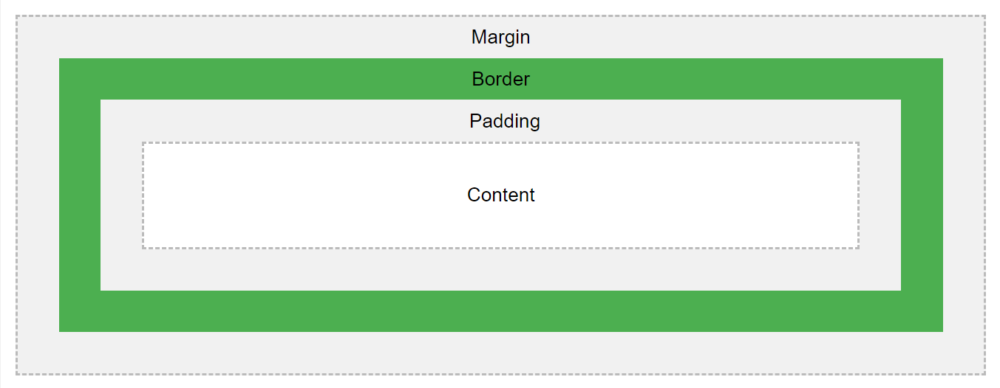

My answer to week3 homework:
---
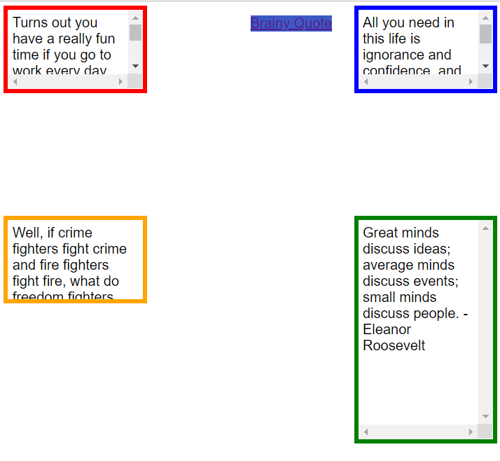

#### 2019-07-16

PHP Syntax
---
How HTML and PHP work together:
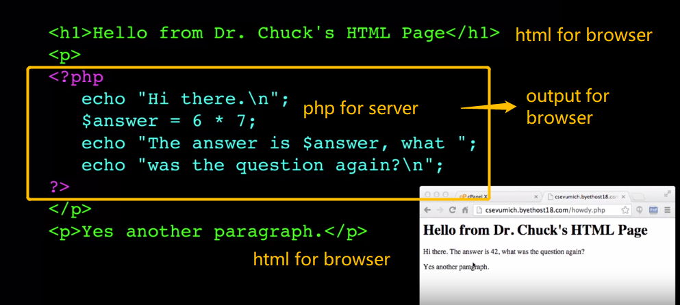
PHP can be right in the middle of the line of HTML

In PHP, variable names are case sensitive, but user defined function names are case-insensitive

all PHP variables have to start with `$` sign. This `$` extends in string for single quotes. `.` is used for string concatenation instead of `+`.

`\n` newline does not work in single quote. PHP supports multilines string, example below will be added `\n` automatically:
```
echo "this is a piece of shit!
oh, you think so too?
you are not listening!
```

There are 3 comment signs in PHP: `//` as C++ style, `#` as perl and shell style, `/*  */` as C style

Below `$x++` operates as a "side effect":
```
$x = 12;
$y = 15 + $x++;
echo "x is $x and y is $y";
```
will print out "x is 13 and y is 27"

Ternary Operators in PHP
---
The ternary operator comes from C. It's like a one-line if-then-else.

example:
```
$www = 123
$msg = ($www % 2) ? "Odd": "Even";
echo "Third: $msg \m";
```
This prints out "Third: Odd"

Casting
---
PHP is very aggresice on castng

`$f = "sam" + 25;`      string part nlow up, it will print out "25"

`$e = (int) 9.9 - 1`    will print out "E: 8"

`$c = 56/12`            will give you 4.666

`echo "A".FALSE."B\n"`  will print out "AB", FALSE doesn't print out well

`echo "X".TRUE."Y\n"`   will print out "X1Y"

`123 == "123"`          true

`123 == "100" + 23`     true

`FALSE == "0"`          true

`(5<6) == "2" - "1"`    true

`(5<6) === TRUE`        true

`(5<6) === 1`        false,  you can use `===` to make it less aggresive

if `strpos` find the string at postion 0, the returned 0 will be evalueated as FALSE. This means even the string is found, the return is false. You have to use `===` here to avoid this.
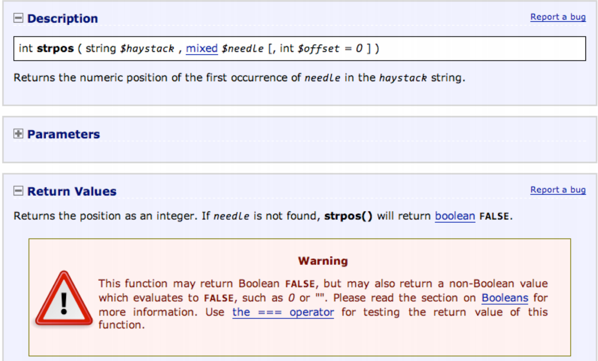

`$a == $b`

Equal true: if $a is equal to $b, after type juggling.

`$a === $b`

Identical true: if $a is equal to $b, and they are of the same typ

```
$values = array(0, 0.0, false, '');
var_dump($values);
print_r ($values);
```
`var_dump` prints out a detailed dump of a variable, including its type and the type of any sub-items (if it's an array or an object). `print_r` prints a variable in a more human-readable form: strings are not quoted, type information is omitted, array sizes aren't given, etc. The above code will give:

```

print and echo are more or less the same; they are both language constructs that display strings. The differences are subtle: print has a return value of 1 so it can be used in expressions whereas echo has a void return type; echo can take multiple parameters, although such usage is rare; echo is slightly faster than print. (Personally, I always use echo, never print.)

var_dump prints out a detailed dump of a variable, including its type and the type of any sub-items (if it's an array or an object). print_r prints a variable in a more human-readable form: strings are not quoted, type information is omitted, array sizes aren't given, etc.

var_dump is usually more useful than print_r when debugging, in my experience. It's particularly useful when you don't know exactly what values/types you have in your variables. Consider this test program:

$values = array(0, 0.0, false, '');

var_dump($values);
print_r ($values);
With print_r you can't tell the difference between 0 and 0.0, or false and '':

array(4) {
  [0]=>
  int(0)
  [1]=>
  float(0)
  [2]=>
  bool(false)
  [3]=>
  string(0) ""
}

Array
(
    [0] => 0
    [1] => 0
    [2] => 
    [3] => 
)
```

With `print_r` you can't tell the difference between `0` and `0.0`, or `false` and `''`:

My answer to week5 hw:
---
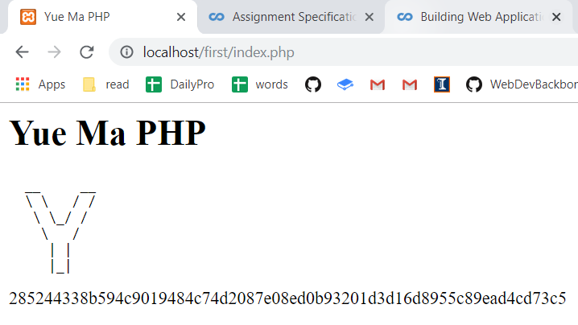

Array
---
```
$va = array();
$va[] = "Hello";
$va[] = "World";
print_r($va);
```
you get:
```
Array(
[0] => Hello
[1] => World
)
```
Looping throug an array:
```
<?php
  $stuff = array("name" => "Chuck"),
                 "course" => "SI664");
  foreach($stuff as $k => $v) {
    echo "Key=", $k, "Val=", $v, "\n";
  }
?>   
```
it gives:
```
Key=name Val=Chuck
Key=course Val=SI664
```
arrays of array:
```
$products = array(
  'paper' => array(
                   'copier' => "Copier & Multipurpose",
                   'laser' => "Laser Printer",
                   ),
   'pen' => array(
                   'ball' => "Ball Point",
                   'marker' => "Markers",
                   )
);
echo $["pen"]["marker"];
//Markers
```

Array functions
---
`array_key_exists($key, $ar)`
`isset($ar['key'])`
`count($ar)`
`is_array($ar)`
`sort($ar)`
`ksort($ar)`
`asort($ar)`
`explode()`
PHP is not object-oriented, many functions are named with undercore of same pre-strings.
 
$\_GET() is a superglobal, it stores the parameters passed from browser, e.g. from URL `?x=1` automatically. Browser did this for us.

