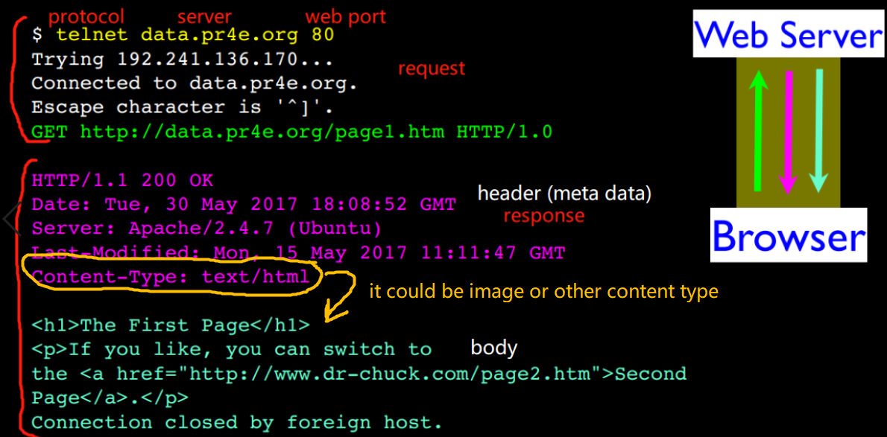

This course is taught by [Charles Severance](https://en.wikipedia.org/wiki/Charles_Severance) on Coursera. He also teaches several topics on Lynda/LinkedIn. I love his style. 

#### 2019-07-15

Important people:
---
Brian Behlendorf: founded Apache

Rasmus Lerdorf: invented PHP

National Institute of Standards and Technology(NIST): SQL

Brendan Eich: invented Javascript

John Resig: started jQuery

Douglas Crockford: "discovered" JSON

Tim Berners-Lee and Robert CailliauT: invented http when they invented www

Tim Berners-Lee: invented URL (protocol+host+document+parameters).

Internet Engineering Task Force (IETF): Internet Standards (are called RFCs)

Important concepts
---
History of programming languages: 


Where HTTP lies: 


where http and sql lay:


Response cycle: 


Topics to learn in this class:


Type the folloing on terminal of Linux based systems (non-Windows basically):


The above is automatically done by browser. You can find it in developer tool (Network-File-Headers):


HTML syntax
----
* all tags: small letter, start and end pair
* attributes: double quotes
* comments: \<!--this comment also works in markdown, have to escape it(　・ˍ・), this can go multiple lines-->
* [html entities](https://www.w3schools.com/html/html_entities.asp)


* Anchor tag &lt;a href=&quot;nooooo&quot;>idk&lt;a> is for hypertext referece 
* \<li>\<p> item 1\</p>\</li>
* ```
  <table>
    <tr>
      <th> header 1</th>
    </tr>
    <tr>
      <td>data 1</td>
    </tr>
  </table>
  ```
No html, no search engine

Structure of HTML document:


HTML feature
----
content is wrapped dynamically:


difference between HTML and DOM:

* DOM is read by browser from HTML
* DOM can fix some syntax mistakes in HTML file)
* you can change DOM in developer tool without changing the HTML source code 


My answer to week2 homework
---


Language types:

* ***Imperative***:

    * tell the compiler step by step

    * ex. C, LINQ:
    
        ```
        List<int> results = new List<int>();
        foreach(var num in collection)
        {
            if (num % 2 != 0)
                  results.Add(num);
        }
        ```
        
    * sub-paradigms: **procedural**, **object-oriented**
        
* ***Declarative***:

    * tell the result you want

    * e.x. SQL, regular expression, HTML, CSS:
    
        `var results = collection.Where( num => num % 2 != 0);`
        
    * sub-paradigms: **functional**, **logic** 
    
    
Cascading Style Sheet (CSS)
---
Tags act in a cascading way. Since all Document Objects/tags are sitting in the hierarchical model, the attributes defined in higher level tags will be cascaded automatically to the lower level, then the lower level can overwrite these "default" attributes if needed. This default cascading behavior can be used together with `class` and `id` to further customize attributes globally.

3 ways to apply CSS to HTML:

* inline - in HTML tag
* embedded - in the /<head> of the document
* external - in a separate file
    
 Most HTML tags have default settings, but `<span>` and `<div>` are the few tags that do not have default setting. `<span></span>` is an inline tag. It does not do anything unless you add `style=""`.  `<div></div>` is an block tag.   
  
 `.` for class, `#` for ID. They are attibutes of tags.
 
 `#e2edff` heximal for RGB.
 
 Fallback fonts: every browswer must have `serif`, `sans-serif`, `monospace`, `cursive` and `fantasy`
 
 `z index` defines who is on the top of others. 
 
 CSS Selector
 ---
 example:
 ```
 <head>
<style>
a:hover {
  background-color: yellow;
}
</style>
</head>
```
 CSS Box Model
 ---


My answer to week3 homework:
---


