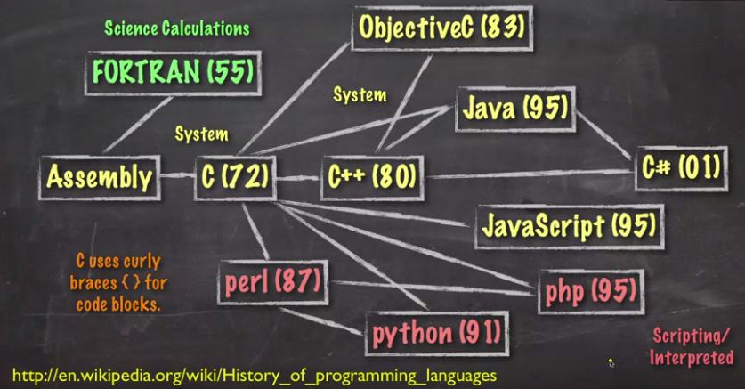
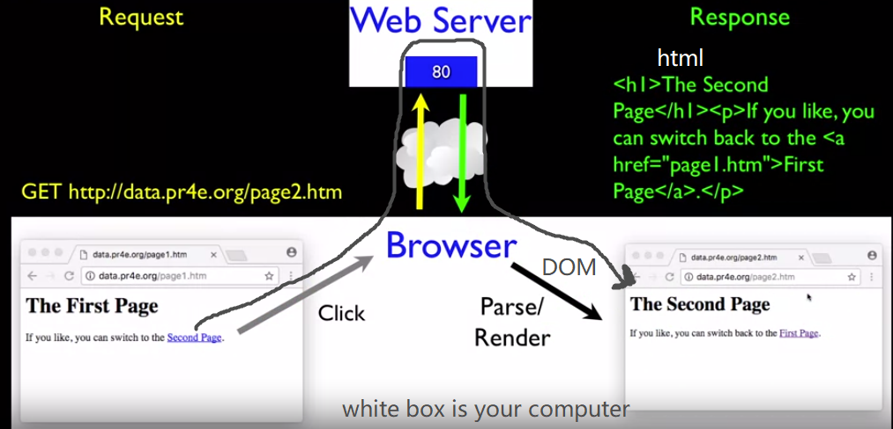

This course is taught by [Charles Severance](https://en.wikipedia.org/wiki/Charles_Severance) on Coursera. He also teaches on Lynda/LinkedIn for a variety of topics. I enjoy his classes. 

#### 2019-07-15

Important people:
---
Brian Behlendorf: founded Apache

Rasmus Lerdorf: invented PHP

National Institute of Standards and Technology(NIST): SQL

Brendan Eich: invented Javascript

John Resig: started jQuery

Douglas Crockford: "discovered" JSON

Tim Berners-Lee and Robert CailliauT: invented http when they invented www

Tim Berners-Lee: invented URL (protocol+host+document+parameters).

Internet Engineering Task Force (IETF): Internet Standards (are called RFCs)

Important concepts
---
History of programming languages: 

Where HTTP lies: 

where http and sql lay:

Response cycle: 

Topics to learn in this class:

Type the folloing on terminal of Linux based systems (non-Windows basically):

The above is automatically done by browser. You can find it in developer tool (Network-File-Headers):

HTML syntax
----
* all tags: small letter, start and end pair
* attributes: double quotes
* comments: \<!--this comment also works in markdown, have to escape it(　・ˍ・), this can go multiple lines-->
* [html entities](https://www.w3schools.com/html/html_entities.asp)

* Anchor tag &lt;a href=&quot;nooooo&quot;>idk&lt;a> is for hypertext referece 
* \<li>\
 item 1\
\</li>
* \<table>

    \<tr>

      \<th>

      \</th>

    \</tr>

    \<tr>

      \<td>

      \</td>

    \</tr>

  \</table>

No html, no search engine

Structure of HTML document:

HTML feature
----
content is wrapped dynamically:

